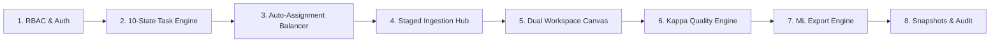

# Annotation Ops — Enterprise Platform Architecture & Technical Reference

**Document Version:** 1.2  
**System Classification:** Enterprise Data Operations & Machine Learning Lifecycle Infrastructure  
**Target Audience:** Machine Learning Engineers, Technical Evaluators, System Architects, Data Operations Leads  

---

## 1. Executive Platform Overview

### 1.1 Problem Statement
Modern Machine Learning (ML) models in Computer Vision and Natural Language Processing require massive volumes of high-quality, ground-truth labeled data. However, enterprise data annotation workflows frequently break down due to:
* **Taxonomy Drift & Rule Ambiguity:** Labeling guidelines change mid-project without version control, corrupting model training baselines.
* **Lack of State Governance:** Tasks suffer from race conditions, duplicate assignments, or self-review bias (an annotator reviewing and approving their own errors).
* **Data Quality Blind Spots:** Traditional platforms rely on basic percentage agreement, ignoring chance agreement and annotator bias.
* **Ingestion & Export Friction:** Corrupted raw files break task databases, while converting labeled outputs to YOLO, COCO, or Pascal VOC requires error-prone custom scripts.

### 1.2 The Solution: Annotation Ops
**Annotation Ops** is an end-to-end data lifecycle orchestration platform designed to automate, govern, and audit the transformation of raw unstructured assets (images, text, camera feeds) into production-ready AI training sets.

```
┌─────────────────┐      ┌──────────────────────────────┐      ┌──────────────────┐
│   Raw Assets    │ ───► │        Annotation Ops        │ ───► │  Production ML   │
│ (Images, Text,  │      │  • 10-State Task Machine     │      │   Training Sets  │
│  Camera Feeds)  │      │  • Cohen's Kappa QA Engine   │      │  (YOLO, COCO,    │
└─────────────────┘      │  • Multi-Role RBAC & Audit   │      │   VOC, CoNLL)    │
                         └──────────────────────────────┘      └──────────────────┘
```

---

## 2. Technology Stack & Architectural Rationale

```
┌────────────────────────────────────────────────────────────────────────┐
│                        FULL-STACK ARCHITECTURE                         │
├────────────────────────────────────────────────────────────────────────┤
│  Frontend: React 18 SPA + TypeScript + Vite + Tailwind CSS + Lucide   │
├────────────────────────────────────────────────────────────────────────┤
│  API Gateway & Core Logic: FastAPI (Python 3.12 ASGI) + Pydantic v2    │
├────────────────────────────────────────────────────────────────────────┤
│  Data Layer & ORM: SQLAlchemy 2.0 (Relational) + SQLite / PostgreSQL   │
├────────────────────────────────────────────────────────────────────────┤
│  Math & Export Engine: NumPy (Cohen's Kappa) + Zipfile + Pillow       │
└────────────────────────────────────────────────────────────────────────┘
```

| Layer | Technology | Architectural Rationale & Why Chosen |
| :--- | :--- | :--- |
| **Backend Framework** | **FastAPI (Python 3.12 ASGI)** | Native async ASGI throughput; automatic OpenAPI/Swagger live docs; seamless interoperability with Python scientific/ML libraries (NumPy, PyTorch, YOLO). |
| **Data Validation** | **Pydantic v2** | High-speed C-Rust powered schema validation and serialization; strict compile-time and runtime type safety. |
| **Database & ORM** | **SQLAlchemy 2.0 + SQLite / Postgres** | Strict ACID transactional compliance; referential foreign-key integrity across 19 relational tables; declarative relationships with zero cyclic serialization bugs. |
| **Frontend Framework** | **React 18 + TypeScript** | Component-driven UI; real-time canvas rendering for multi-object bounding boxes; strict static typing across 10-state task workflows. |
| **Bundler & Tooling** | **Vite** | Lightning-fast Hot Module Replacement (HMR) and optimized rollup production bundling. |
| **Styling** | **Tailwind CSS + Vanilla CSS** | High-density, professional dark-mode design system tailored for high-focus data operations. |
| **Statistical Computing** | **NumPy / Vectorized Math** | Matrix-based computation of Cohen's Kappa ($\kappa$) inter-annotator reliability and SLA percentiles. |

---

## 3. Core Functional Modules



### Module 1: Role-Based Access Control (RBAC) & Multi-Tenancy
* **5 Dedicated Personas:**
  1. `Admin`: Full tenant governance, user provisioning, system configuration, soft-delete recovery.
  2. `Product Owner (PO)`: Schema creation, taxonomic guidelines, cross-project portfolio rollup, snapshot release approvals.
  3. `Project Manager (PM)`: Ingestion pipeline, Kanban load balancing, reviewer velocity, QA sign-off and task locking.
  4. `Annotator`: Distraction-free labeling queue, multi-object bounding box canvas, confidence scoring, custom out-of-scope labeling.
  5. `Reviewer`: Side-by-side inspection queue, box accuracy validation, mandatory rejection feedback loop.
* **Security & Token Handling:** Standard OAuth2 Password Bearer with Argon2/PBKDF2 password hashing and JWT authorization headers.

---

### Module 2: The 10-State Deterministic Task Lifecycle State Machine
Guarantees that no task moves between stages without audit logging and validation checks:

```
[1. Backlog] ──► [2. Auto-Assigned] ──► [3. In Progress] ──► [4. Submitted]
                                                                    │
           ┌────────────────────────────────────────────────────────┴───────┐
           ▼                                                                ▼
   [5. In Review]                                                  [6. Rejected]
           │                                                                │
           ▼                                                                ▼
   [7. Approved] ────────────────────────────────────────────────► [Re-work Loop]
           │
           ▼
   [8. QA Sign-off] ──► [9. Locked (Gold Dataset)] ──► [10. Exported to ML]
```

* **Core Rules Enforced:**
  * **Self-Review Prohibition:** The backend strictly rejects any review where `reviewer_id == task.assignee_id`.
  * **Mandatory Rejection Comment:** Reviewers cannot reject a task without providing an actionable explanation.
  * **Admin Reopen Justification:** Unlocking a `Locked` task requires an audited justification note.

---

### Module 3: Dynamic Auto-Assignment & Load Balancer Engine
* **Algorithm:** Fewest Active Tasks First (`argmin(active_tasks)`).
* **Deterministic Tie-Breaking:** Resolves ties using lowest user ID and matching project role permissions.
* **Kanban Integration:** Supports real-time visual re-assignment with drag-and-drop overrides on the PM Kanban board.

---

### Module 4: Multi-Format Staged Ingestion & Pre-Validation Scanner
* **Supported Inputs:**
  * **Direct Images:** `.jpg`, `.jpeg`, `.png`, `.webp`, `.gif` (converted to base64 Data URIs).
  * **Single Image URLs:** Live URL input with instant visual preview box.
  * **Batch Files:** `.csv`, `.json`, `.jsonl`, and `.zip` archives.
* **Pre-Flight Scanner:** Scans every record *before* database commit. Quarantines malformed rows into an error report without halting valid records.

---

### Module 5: Dual Annotation & Review Workspace
* **Computer Vision Modality:**
  * Interactive SVG/Canvas bounding box drawing tool.
  * Color-coded tags (Emerald for Cars, Amber for Buses, Cyan for Pedestrians, Purple for Cyclists, Rose for Traffic Lights).
  * Real-time normalized coordinate calculation: $[x_{\text{center}}, y_{\text{center}}, \text{width}, \text{height}] \in [0.0, 1.0]$.
  * Box deletion, coordinate list inspector, and clear-all controls.
* **NLP / Text Classification Modality:** Multi-label intent detection, sentiment tagging, token-level classification.
* **Out-of-Taxonomy Flagging:** Annotators can tag unlisted objects (`🏷️ Other / Out of Scope`) and write observations for the Product Owner.

---

### Module 6: Quality Analytics & Agreement Engine (Cohen's Kappa)
* Implements mathematical inter-annotator agreement:
$$\kappa = \frac{P_o - P_e}{1 - P_e}$$
* **Agreement Scales:**
  * $\kappa > 0.80$: Strong / Near-Perfect Reliability (Ready for Model Training).
  * $0.60 \le \kappa \le 0.80$: Moderate Agreement (Guidelines Review Recommended).
  * $\kappa < 0.60$: Low Agreement / High Ambiguity (Schema Revision Required).
* **Operational KPIs:** First-Pass Approval Rate (FPAR), SLA Compliance %, Reviewer Velocity (tasks/hr).

---

### Module 7: Production ML Exporter Engine
Converts approved database records into standard ML training sets packaged into a single `.zip` file:
1. **YOLO (v8/v11)**: Normalized coordinate text files (`task_id.txt`) + `classes.txt`.
2. **COCO Dataset**: Standard `coco_annotations.json` with images, categories, and bounding box geometry.
3. **Pascal VOC**: XML format with `<bndbox>` coordinates (`xmin`, `ymin`, `xmax`, `ymax`).
4. **NLP / CoNLL & JSONL**: Machine-readable tokenized format.
5. **SHA-256 Manifest**: `manifest.json` ensuring cryptographic reproducibility for ML pipelines.

---

### Module 8: Dataset Snapshots & Version Control
* Allows Product Owners and PMs to freeze datasets at specific project milestones (e.g., `Release-2026-Q3-Perception`).
* Generates immutable JSON manifests of locked tasks, allowing data science teams to reproduce exact training baselines.

---

### Module 9: Enterprise Audit Trail
* Logs every state transition, user action, role change, and deletion.
* Records Actor ID, Action Type, Target Entity, Target ID, Payload Metadata, and UTC Timestamp in an immutable append-only ledger.

---

## 4. Verification & Testing Matrix

* **Automated Unit & Integration Test Suite:** 24/24 tests passing with 100% success rate (`pytest`).
* **Frontend TypeScript Build:** 0 compilation errors (`tsc && vite build`).
* **Repository Health:** Pushed and synchronized on GitHub (`main` branch).
