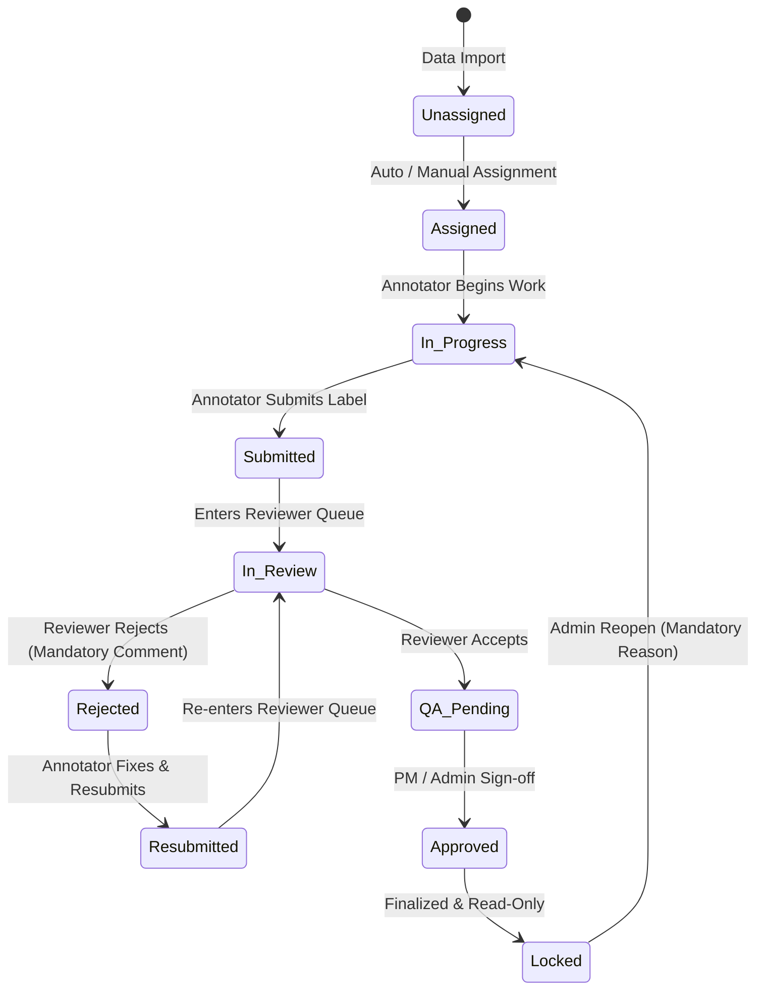

# System Architecture — Annotation Ops v1

Annotation Ops is an operational management, workflow automation, and analytics platform designed specifically for annotation teams.

```
+-------------------------------------------------------------------------------+
|                                  CLIENT LAYER                                 |
|         React 18 + TypeScript + Vite + Tailwind CSS + TanStack Query          |
|  [Admin Center] [PO Portfolio] [PM Kanban] [Annotator Work] [Reviewer Work]   |
+-------------------------------------------------------------------------------+
                                       |
                                       | HTTPS / REST (JWT Bearer)
                                       v
+-------------------------------------------------------------------------------+
|                              APPLICATION LAYER                                |
|                         FastAPI Backend Framework                             |
|  +----------------+  +-----------------+  +-----------------+  +------------+ |
|  | Auth & RBAC    |  | Workflow Engine |  | Load Balancer   |  | Analytics  | |
|  | (5 Roles)      |  | (State Machine) |  | (Fewest-Active) |  | (Kappa/KPI)| |
|  +----------------+  +-----------------+  +-----------------+  +------------+ |
|  | Import & Ingest|  | Export Service  |  | Notifications   |  | Audit Log  | |
|  | (Row Validator)|  | (COCO/YOLO/etc) |  | (In-App/Email)  |  | (Append)   | |
|  +----------------+  +-----------------+  +-----------------+  +------------+ |
+-------------------------------------------------------------------------------+
             |                                    |                 |
             v                                    v                 v
+------------------------+             +-------------------+  +-----------------+
| BACKGROUND PROCESSING  |             |    DATA LAYER     |  | EXTERNAL / ML   |
| APScheduler Worker     |             | PostgreSQL /      |  | ML Pipelines /  |
| - SLA deadline check   |             | SQLite Storage    |  | Export consumer |
| - Workload rebalancer  |             | (SQLAlchemy 2.0)  |  | Resend Email    |
+------------------------+             +-------------------+  +-----------------+
```

---

## 1. Multi-Layer Architecture

### 1.1 Client Layer (Frontend)
- **Framework**: React 18, TypeScript, Vite.
- **Routing**: React Router with role-based Route Guards.
- **State & Data Fetching**: TanStack Query for cache invalidation, background refetching, and optimistic updates.
- **Design System**: Tailwind CSS, Lucide Icons, Recharts for data visualization, and custom accessible UI components (Dialog, Dropdown, Tabs, Toast).
- **Core Modules**:
  - `AdminDashboard`: Global user management, project creation, soft-delete recovery, system audit logs.
  - `PortfolioDashboard`: Cross-project rollup for Product Owners.
  - `ProjectDashboard`: Real-time project KPIs, progress bars, throughput charts, activity feed.
  - `SchemaEditor`: Visual taxonomy designer, markdown guideline editor, immutable schema versioning.
  - `ImportPipeline`: Staged CSV/JSON/archive validator, row-level error inspector, task generation.
  - `AnnotatorWorkspace`: Priority-ordered personal task queue, built-in classification labeling editor with media preview (images, text, audio), guidelines drawer, threaded comments.
  - `ReviewerWorkspace`: Review queue, side-by-side submission inspector, diff comparison, accept/reject with required comments.
  - `QASignoffPage`: PM/Admin QA queue, sign-off $\rightarrow$ approved $\rightarrow$ locked, Admin reopen modal with required reason.
  - `KanbanBoard`: 10-column interactive board with filters and backend-enforced transitions.
  - `ExportCenter`: Multi-format exporter (COCO, YOLO, Pascal VOC, CoNLL, JSONL) with traceability manifests.

### 1.2 Application Layer (FastAPI Backend)
- **Modularity**:
  - `auth.py`: Password hashing (PBKDF2/SHA256 with random salt), JWT creation/decoding, `get_current_user` dependency, and server-side RBAC guard `check_project_role`.
  - `workflow.py`: Strict task state transition engine enforcing valid transitions, permission checks, status history recording, and append-only audit logging.
  - `assignment.py`: Load balancing algorithm (fewest active tasks, oldest assignment timestamp, user ID tie-breaker), configurable batching, and manual reassignment tracking.
  - `import_service.py`: Multi-format data validation (CSV, JSON, archive), row-level error detection, dataset registration, and batch task creation.
  - `export_service.py`: Generates standardized ML export formats (COCO JSON, YOLO Darknet, Pascal VOC XML, CoNLL NER format, JSONL) accompanied by traceability `manifest.json`.
  - `analytics.py`: Real-time SQL aggregations for project KPIs, annotator productivity, reviewer statistics, and mathematical Cohen's Kappa for inter-annotator agreement on categorical schemas.
  - `notifications.py`: In-app notification dispatcher with unread status tracking and optional email provider abstraction (e.g., Resend).
  - `scheduler.py`: In-process background worker powered by APScheduler for SLA monitoring and auto-assignment sweeps.

### 1.3 Data Layer (Persistence)
- **Database**: PostgreSQL (production) and SQLite (development/testing) via SQLAlchemy 2.0 ORM.
- **Normalization**: Fully normalized entities with foreign keys, composite indexes, and cascade policies.
- **Immutability**: Append-only `task_versions` (retaining full submission history across rejections) and `audit_logs` for non-repudiation.

---

## 2. Workflow State Machine

The task lifecycle is modeled as a strictly validated state machine:



### State Machine Transition Rules
1. **Self-Review Prevention**: An annotator who submitted a version of a task cannot act as the reviewer for that same task.
2. **Mandatory Rejection Comment**: A reviewer cannot reject a task without providing a non-empty comment explaining the defect.
3. **Mandatory Reassignment Reason**: A PM cannot reassign a task without documenting the reason in `assignment_history`.
4. **Mandatory Reopen Reason**: A locked task cannot be reopened without an Admin-provided reason recorded in the audit trail.
5. **Immutable Versioning**: Resubmitting a task creates a new `TaskVersion` (version N+1) without deleting or altering version N.

---

## 3. Database Schema Overview

```
+-----------------------------------+
|               users               |
|-----------------------------------|
| id (PK)                           |
| name, email, hashed_password      |
| global_role ('admin' | 'user')    |
| created_at                        |
+-----------------------------------+
                  | 1
                  |
                  | *
+-----------------------------------+        * +-----------------------------------+
|        project_memberships        | -------- |              projects             |
|-----------------------------------|          |-----------------------------------|
| id (PK)                           |          | id (PK)                           |
| user_id (FK -> users.id)          |          | name, description, settings_json  |
| project_id (FK -> projects.id)    |          | created_by (FK -> users.id)       |
| project_role (5 Roles)            |          | is_archived, archived_at          |
+-----------------------------------+          | is_deleted, deleted_at            |
                                               +-----------------------------------+
                                                                 | 1
                                                                 |
                                       +-------------------------+-------------------------+
                                       | *                       | *                       | *
                        +----------------------+  +----------------------+  +----------------------+
                        |   schema_versions    |  |       datasets       |  |  dataset_snapshots   |
                        |----------------------|  |----------------------|  |----------------------|
                        | id (PK)              |  | id (PK)              |  | id (PK)              |
                        | project_id (FK)      |  | project_id (FK)      |  | project_id (FK)      |
                        | version_number       |  | name, file_path      |  | name                 |
                        | taxonomy_json        |  | total_items          |  | version_manifest_json|
                        | guidelines_text      |  | created_at           |  | created_at           |
                        | defined_by (FK)      |  +----------------------+  +----------------------+
                        +----------------------+             | 1                       | 1
                                   | 1                       |                         |
                                   |                         | *                       | *
                                   |              +----------------------+  +----------------------+
                                   +------------- |        tasks         |  |snapshot_task_versions|
                                                  |----------------------|  |----------------------|
                                                  | id (PK)              |  | id (PK)              |
                                                  | project_id (FK)      |  | snapshot_id (FK)     |
                                                  | dataset_id (FK)      |  | task_id (FK)         |
                                                  | schema_version_id(FK)|  | task_version_id (FK) |
                                                  | data_ref (Text/JSON) |  +----------------------+
                                                  | status, priority     |
                                                  | assigned_to (FK)     |
                                                  | created_at           |
                                                  +----------------------+
                                                             | 1
                               +-----------------------------+-----------------------------+
                               | *                           | *                           | *
                +----------------------+      +----------------------+      +----------------------+
                |    task_versions     |      |       reviews        |      |       comments       |
                |----------------------|      |----------------------|      |----------------------|
                | id (PK)              |      | id (PK)              |      | id (PK)              |
                | task_id (FK)         |      | task_id (FK)         |      | task_id (FK)         |
                | submitted_by (FK)    |      | reviewer_id (FK)     |      | author_id (FK)       |
                | payload_json         |      | decision, comment    |      | content              |
                | version_number       |      | created_at           |      | parent_id (FK, self) |
                | created_at           |      +----------------------+      | created_at           |
                +----------------------+                                    +----------------------+
```
