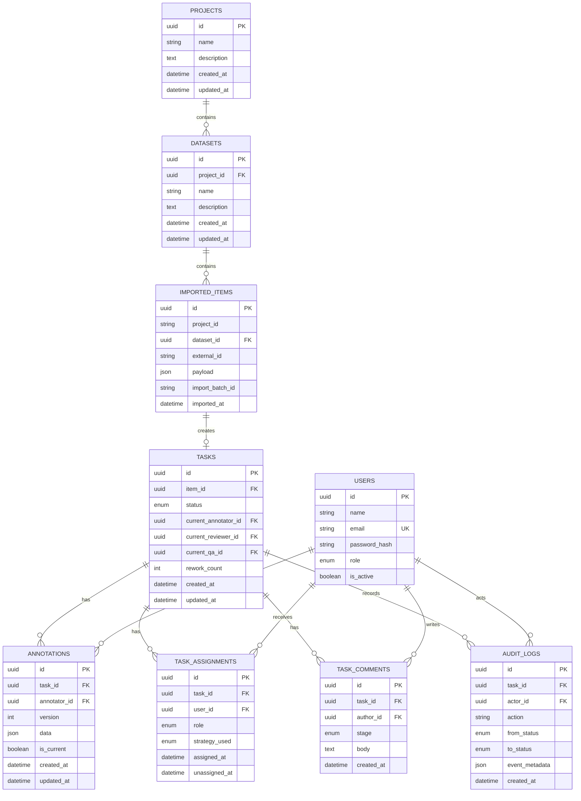

# Phase 2 — ER Diagram / Database Schema

The schema below is the shared foundation used by Phase 2 and the existing
Phase 3 workflow engine.

## Role set

- `admin`
- `project_manager`
- `annotator`
- `reviewer`
- `qa` — retained because the existing Phase 3 engine uses a QA stage.

## Phase 2 acceptance mapping

- **Users** — JWT authentication and role information.
- **Projects / datasets** — project hierarchy and dataset ownership.
- **Imported items** — raw CSV/JSON data waiting to be annotated.
- **Tasks** — workflow unit created from an imported item.
- **Annotations** — versioned annotation payloads attached to tasks.
- **Task assignments** — assignment history used by the Phase 3 engine.
- **Task comments** — reviewer/QA feedback.
- **Audit logs** — append-only workflow history.

`imported_items.project_id` intentionally remains a string for compatibility
with the existing Phase 3 implementation. The Phase 2 import APIs validate the
project and dataset relationship before inserting data.
